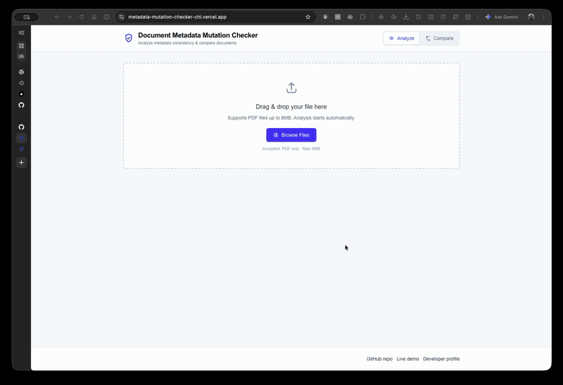

# Metadata Mutation Checker

Frontend-only Next.js demo for checking PDF metadata consistency and potential mutation signals.

**Live demo:** [metadata-mutation-checker-chi.vercel.app](https://metadata-mutation-checker-chi.vercel.app/)

## Demo



This short demo shows the PDF upload flow, metadata extraction, mutation signal checks, risk summary, and generated findings.

## Who is this for?

Anyone whose workflow involves accepting PDFs from external parties where authenticity matters:

- **Legal & compliance** — verify contracts, agreements, and submitted documents haven't been backdated or re-exported
- **HR & recruitment** — spot-check academic certificates and employment letters before interviews
- **Finance & insurance** — flag invoices, receipts, or claim documents potentially modified after submission
- **Journalism & research** — verify provenance of leaked or archival PDFs before publishing
- **Procurement** — check that tender submissions weren't altered after the deadline

The tool gives a fast first-pass signal in seconds — not a replacement for forensic experts, but a practical filter before deciding whether to escalate.

## Branches

| Branch | Description |
|---|---|
| `frontend-demo` _(this branch)_ | Self-contained Next.js demo — deployed on Vercel, no backend required |
| `main` | Full-stack source — Python FastAPI backend + Next.js frontend + Docker Compose |

## Local Development

```bash
npm install
npm run dev
```

Open `http://localhost:3000`.

The PDF analysis runs in the same Next.js deployment via the `/api/analyze` route — no separate backend needed.

## Deploy on Vercel

Use the repository root as the Vercel root directory. Set **Production Branch** to `frontend-demo`.

```text
Branch:           frontend-demo
Root Directory:   (leave blank — project root)
Framework:        Next.js
```

## API

```text
POST /api/analyze
```

Upload field: `file` (PDF, max 8 MB)

Optional env variable: `MAX_UPLOAD_SIZE_MB=8`
