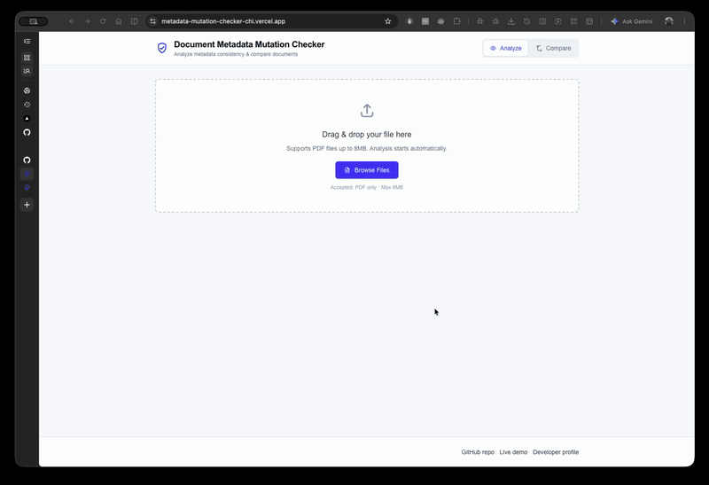

# Metadata Mutation Checker

Frontend-only Next.js demo for checking PDF metadata consistency and potential mutation signals.

**Live demo:** [metadata-mutation-checker-chi.vercel.app](https://metadata-mutation-checker-chi.vercel.app/)

## Demo



This short demo shows the PDF upload flow, metadata extraction, mutation signal checks, risk summary, and generated findings.

## Who is this for?

Anyone whose workflow involves accepting PDFs from external parties where authenticity matters:

- **Legal & compliance** — verify contracts, agreements, and submitted documents haven't been backdated or re-exported
- **HR & recruitment** — spot-check academic certificates and employment letters before interviews
- **Finance & insurance** — flag invoices, receipts, or claim documents potentially modified after submission
- **Journalism & research** — verify provenance of leaked or archival PDFs before publishing
- **Procurement** — check that tender submissions weren't altered after the deadline

The tool gives a fast first-pass signal in seconds — not a replacement for forensic experts, but a practical filter before deciding whether to escalate.

## Branches

`frontend-demo` is the default branch and contains the deployed demo. The former
full-stack `main` branch history has been merged here. The standalone Next.js
app remains at the repository root, and the Python FastAPI service is retained
under `backend/` for independent use.

## Local Development

```bash
npm install
npm run dev
```

Open `http://localhost:3000`.

The demo analyzes PDFs through its Next.js `/api/analyze` route and does not
require the Python service. `docker compose up --build` also starts the retained
FastAPI service at `http://localhost:8000` for independent use.

The existing Playwright suite can be run locally with:

```bash
npx playwright install chromium
npm run test:e2e
```

## Deploy on Vercel

Use the repository root as the Vercel root directory. Set **Production Branch** to `frontend-demo`.

```text
Branch:           frontend-demo
Root Directory:   (leave blank — project root)
Framework:        Next.js
```

## API

```text
POST /api/analyze
```

Upload field: `file` (PDF, max 8 MB)

Optional env variables: `MAX_UPLOAD_SIZE_MB=8` and `NEXT_PUBLIC_SITE_URL`.
